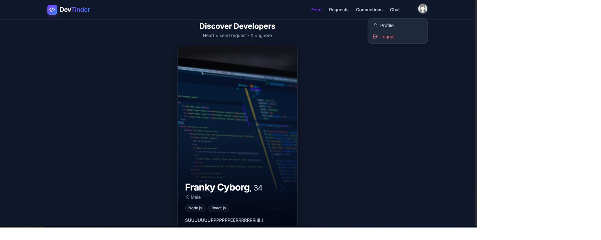
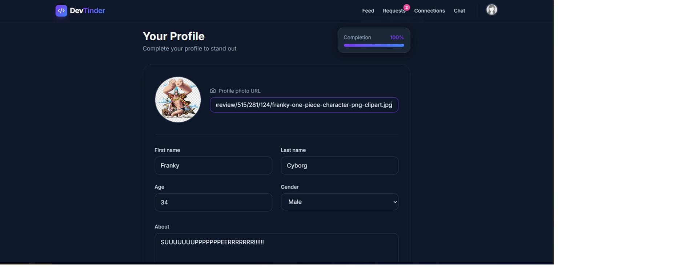
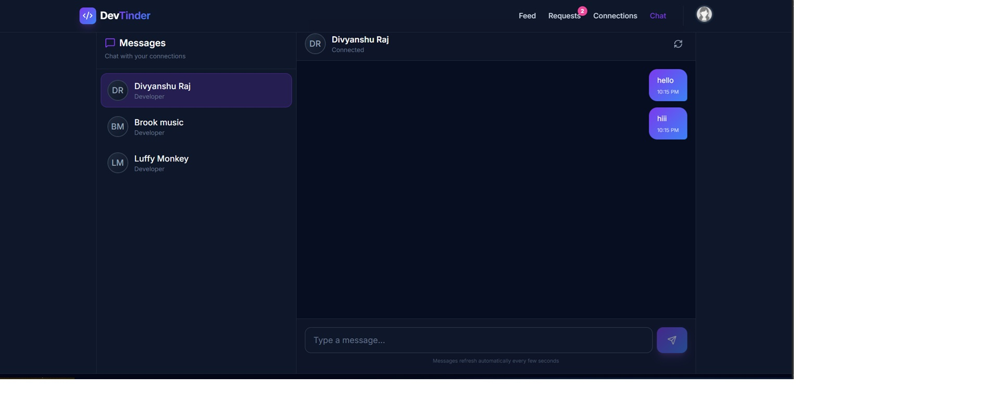
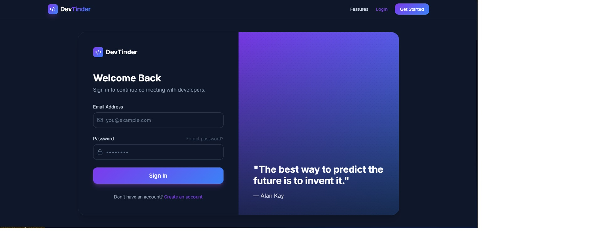
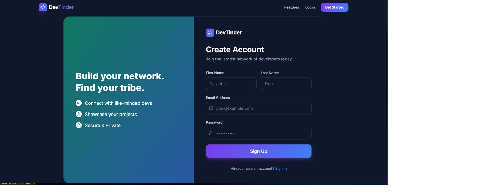
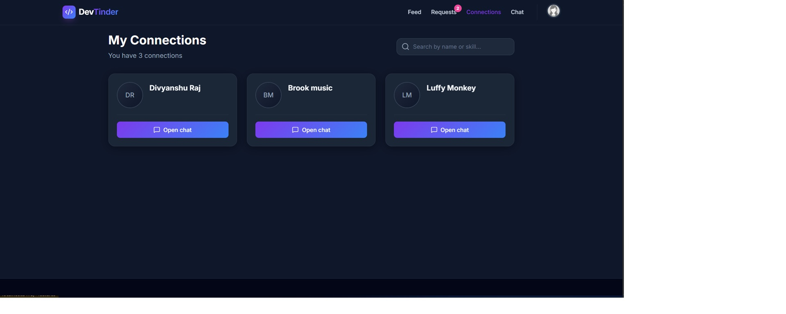

<div align="center">


<p align="center">
  <strong>A full-stack developer networking platform where developers connect, collaborate, and build meaningful professional relationships based on their skills and interests.</strong>
</p>

<p align="center">
  
  
  
  
  
</p>

<p align="center">
  <a href="https://github.com/divyanshuraj1095/DevTinder/stargazers">
    
  </a>
  <a href="https://github.com/divyanshuraj1095/DevTinder/forks">
    
  </a>
</p>

</div>

---

## 📸 Screenshots

<div align="center">

| Feed | Profile | Chat |
|------|---------|------|
|  |  |  |

| Sign In | Sign Up | Connections |
|---------|---------|-------------|
|  |  |  |

</div>

---

## 🌟 Features

<table>
  <tr>
    <td>

### 👤 Authentication
- Secure Signup & Login
- JWT-based Authentication
- Protected Routes
- Cookie-based Session Handling

### 🧑‍💻 Developer Profiles
- Create and Edit Profile
- Add Skills, Bio, and Interests
- View Other Developer Profiles

    </td>
    <td>

### 🤝 Connection System
- Send Connection Requests
- Accept / Reject Requests
- View All Connections
- Explore New Developers

### 💬 Networking
- Discover developers with similar interests
- Build your professional network
- Interactive developer feed

    </td>
  </tr>
</table>

---

## 🛠️ Tech Stack

| Layer | Technology |
|-------|-----------|
| **Frontend** | React.js, React Router, Axios, CSS3 |
| **Backend** | Node.js, Express.js |
| **Database** | MongoDB, Mongoose |
| **Auth & Security** | JWT, bcrypt.js, cookie-parser, CORS |

---

## 📁 Project Structure

```
DevTinder/
│
├── backend/
│   ├── src/
│   │   ├── config/
│   │   ├── models/
│   │   ├── routes/
│   │   ├── middleware/
│   │   └── app.js
│   ├── package.json
│   └── .env
│
├── frontend/
│   ├── src/
│   ├── public/
│   └── package.json
│
└── README.md
```

---

## ⚙️ Installation & Setup

### 1️⃣ Clone the Repository

```bash
git clone https://github.com/divyanshuraj1095/DevTinder.git
cd DevTinder
```

---

### 🔧 Backend Setup

```bash
cd backend
npm install
```

**Create a `.env` file:**

```env
PORT=7777
MONGO_URI=your_mongodb_connection_string
JWT_SECRET=your_secret_key
```

**Run the backend server:**

```bash
npm run dev
```

---

### 🎨 Frontend Setup

```bash
cd frontend
npm install
```

**Create a `.env` file:**

```env
VITE_BACKEND_URL=http://localhost:7777
```

**Run the frontend:**

```bash
npm run dev
```

---

## 🌐 Deployment

| Layer | Platform |
|-------|----------|
| **Frontend** | Vercel / Netlify |
| **Backend** | Render / Railway |
| **Database** | MongoDB Atlas |

---

## 🚀 Roadmap

- [ ] Real-time Chat System
- [ ] WebSocket Integration
- [ ] Notifications System
- [ ] Advanced Matching Algorithm
- [ ] Profile Recommendations
- [ ] Dark Mode
- [ ] Video Calling / Collaboration
- [ ] AI-based Skill Recommendations

---

## 🤝 Contributing

Contributions are welcome and appreciated! Here's how to get started:

1. **Fork** the repository
2. **Create** a new branch (`git checkout -b feature/your-feature`)
3. **Commit** your changes (`git commit -m 'Add some feature'`)
4. **Push** to the branch (`git push origin feature/your-feature`)
5. **Open** a Pull Request

---

## 📬 Contact

<div align="center">

### 👨‍💻 Divyanshu Raj

[](mailto:divyanshuraj23102005@gmail.com)
[](https://github.com/divyanshuraj1095)
[](https://www.linkedin.com/in/divyanshu-raj-37017a306)

</div>

---

<div align="center">

### ⭐ If you liked this project, give it a star on GitHub!

*It means a lot and helps others discover the project.*

</div>